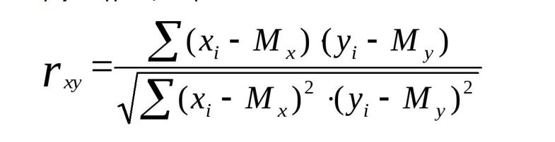

# Урок 4. Функциональное программирование
## Classwork
### task001:
Нормализация данных:
● Контекст
Есть такая операция в статистике - “нормализация”. Это операция принимающая на вход вектор и
возвращающая другой вектор. Смысл этой операции в том, чтобы данные из разных шкал загнать в
единый диапазон, как правило - от 0 до 1, тогда с данными становится проще работать.
● Ваша задача:
Реализовать с использованием функциональной парадигмы процедуру normalization, которая выполняет
нормализацию полученного массива по приведенной формуле нормализованного значения элемента, где
○ x_norm - нормализованное значение элемента
○ x - исходное значение элемента
○ x_max, x_min - максимальное и минимальное значение в массиве

### task002:
Фильтрация данных:
Контекст
Предположим, что есть какой-то массив содержащий данные о разных людях и их возрасте и вас
попросили ответить на следующий вопрос: “сколько в массиве людей возраста > 30?”. Для этого, вы
хотите написать программу для фильтрации наблюдений по возрастному признаку.
● Ваша задача:
Написать скрипт принимающий на вход массив с данными о людях и число - возраст, а возвращающий
число - количество людей старше указанного возраста.

### task003:
● Контекст:
Важнейшая задача в анализе данных - поиск дубликатов. Дубликат - это наблюдение, встречающееся в
данных больше одного раза. Такие наблюдения не просто не улучшают результат анализа или
полученных моделей, но и замедляют весь процесс в целом, поэтому аналитики и разработчики
предпочитают избавляться от них перед тем как приступить к анализу.
● Ваша задача:
Реализовать с использованием функциональной парадигмы процедуру для поиска дубликатов. На вход
подается массив, где могут присутствовать дубликаты (а могут и не присутствовать). При применении к
массиву, дубликаты должны быть выведены на экран в виде списка.

### task004:(кейс)
Кейс. Сервер обработки данных
Обсуждение:
Для выполнения подобного проекта скорее всего потребуется немало
часов и людей с разной экспертизой. В одном из вариантов
реализации, в архитектуре сервера будут присутствовать следующие
составляющие:
● База данных
● Сервис для обработки запросов
● Сервис для аутентификации и управления аккаунтами
● Сервис финансовых операций
Каждый из этих сервисов может быть исполнен разными
технологиями, поэтому важно учитывать текущий технологический
стек. Использование функциональной парадигмы может быть очень
полезным при обработке сотен тысяч запросов или анализа данных
большого объёма. В таком случае, и данные и запросы - являются
массивами, а то, что мы хотим с ними сделать - математическими
функциями.
Для финансовых операций и аутентификации скорее всего будет
очень удобно использовать ООП вместе со структурным и
процедурным стилями: например, различные счета клиента - это
экземпляры класса Счет с методом перевод средств.

## Homework
### task001:
Корреляция:
Контекст
Корреляция - статистическая мера, используемая для оценки
связи между двумя случайными величинами.
● Ваша задача
Написать скрипт для расчета корреляции Пирсона между
двумя случайными величинами (двумя массивами). Можете
использовать любую парадигму, но рекомендую использовать
функциональную, т.к. в этом примере она значительно
упростит вам жизнь.
● Формула корреляции Пирсона:
